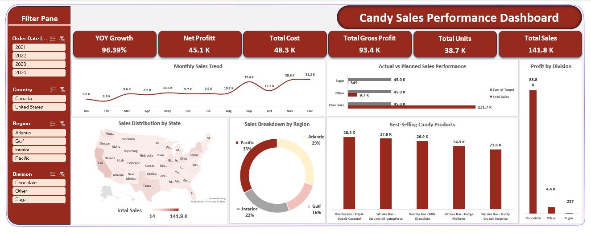

#  Candy Sales Dashboard – Excel Project

##  Project Overview
This project analyzes candy sales data using **Excel**, **Power Query**, and **Power Pivot** to create an interactive **Dashboard** for business insights.  
The goal is to track performance against targets, identify top-selling products, and visualize sales trends.

---

##  Tools & Technologies Used
- **Excel**
- **Power Query** (for data cleaning and transformation)
- **Power Pivot** (for Data Modeling)
- **Pivot Tables & Charts**
- **Data Model with Fact & Dimension Tables**

---

##  Dataset
The project uses 5 tables:
1. `Candy_Factories`
2. `Candy_Products`
3. `Candy_Sales`
4. `Candy_Targets`
5. `uszips` (Geographic Data for Map Chart)

---

##  Project Workflow
1. **Data Cleaning & Transformation**
   - Removed duplicates
   - Fixed date formats
   - Standardized product and region names
2. **Data Modeling**
   - Created a **Fact Table** (`Candy_Sales`)
   - Linked to **Dimension Tables** (`Candy_Factories`, `Candy_Products`, `uszips`)
   - Established relationships for efficient analysis
3. **KPIs Calculation**
   - Total Sales
   - Total Units Sold
   - Total Profit
   - Target vs Actual Performance
4. **Dashboard Creation**
   - Sales Overview
   - Top Products
   - Sales by Region (Map Chart)
   - Sales vs Target
   - Monthly Trends

---

##  Data Model

---

##  Dashboard Preview

---

##  Insights from the Dashboard
- Identify **top-selling products** and **high-performing regions**.
- Monitor **sales growth trends** over time.
- Compare **actual performance against targets**.

---

##  Contact
**Sarah Ali Mansy**  
📧 saraalimansi2@gmail.com  
🔗 [LinkedIn](https://www.linkedin.com/in/sarah-ali-6457ba329/) 
🔗 [Portfolio](https://sarahalimansi.wordpress.com/) 

